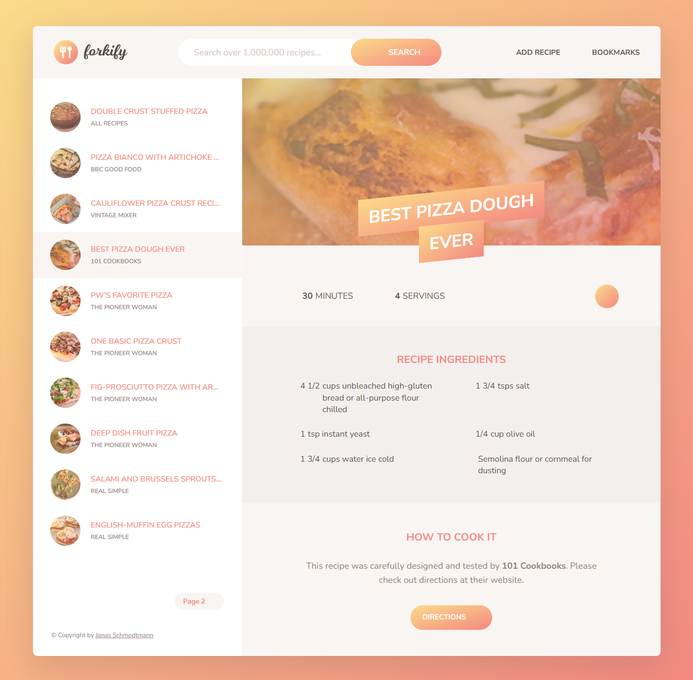

# Forkify

This project was created as part of a **JavaScript & Web Development** Udemy course.  
The project focuses on building a **recipe search application** using modern JavaScript and third-party APIs.

## 🚀 Features
- **JavaScript Vanilla** – Built using plain JavaScript with ES6+ features.  
- **Third-Party API** – Fetch recipes from an external API.  
- **Responsive Design** – Fully mobile-friendly interface for an optimal user experience.  
- **Custom Search** – Allows users to search recipes by ingredients or dish name.  
- **Dynamic User Interface** – Recipes are displayed dynamically as users interact with the app.  

## 📅 Project Details
- **Course**: Udemy - The Complete JavaScript Course 2023: From Zero to Expert!
- **Year**: 2023
- **Technologies**: JavaScript, HTML, CSS, Third-party APIs  

## 📸 Preview  
   

---

⭐ This was a learning project and is not actively maintained.
